# オブジェクト指向

## 目的

- 将来のブログネタ
- 後輩が読んでわかりやすい内容
- 自身の振り返りにするべく複数の書籍情報の結合

## おすすめ参考資料

- Udemy ピックアンダーソン オブジェクト指向
  - 本読むのめんどくさい人におすすめ。話者の声の質に難ありだが内容はわかりやすい

## オブジェクト指向の第五原則

### 単一責務の原則

- クラスの責務は一つにする
- クラスを変更する理由は１つ以上存在してはならない
- 一言で説明できるクラス名

- ダメな例
  - 変更理由：データの入力方法・保存するDBの変化

```plantuml
@startuml
class "複数責務のクラス"{
- データの入力
- DBにデータの保存
- DBから値を取り出す
} 
@enduml
````

- 正しい分け方
    - 変更理由事にクラスを分ける
    - データの入力、保存するDBの変化といった２つの理由でクラスを分割する

```plantuml
@startuml
left to right direction

class "DBにデータアクセスのクラス" as DB{
- DBにデータの保存
- DBから値を取り出す
} 

class "データ入力のクラス" as write{
- データの入力
} 

write -- DB
@enduml
````

#### 3層構造

- ビジネスルールとデータの永続化を一緒にしてはならない

- 画面
    - データを取得してリストに表示
- ビジネスロジック
    - 自分で使用を調整する部分
    - ex データの編集など
- データアクセス
    - データを永続化させるためのシステム

#### クラスの在り方

- 修正箇所を最小限にする
- 修正する場所が明確にする
    - メソッドが多すぎるとメンテナンスがとても大変になる。修正に関係するメソッドを確認していかなければならない
    - 修正に時間がかかるとは：修正箇所を探す（２番目）、修正する、ほかに影響を調べる（１番時間がかかる）
- インデックスのように用いる
- クラスは機能ごとに小さく作る
    - 使う側が各部品をつまんできて機能を達成する

#### オープンクローズドの原則

- クラスは拡張に対して開いてなければならなず、変更に対し閉じている
- 既存のシステムをいじると再テストが必要、既存のシステムをいじりたくはない

```plantuml
@startuml

left to right direction

class "Client"{
    var p = new IPoint()
    p.GetPoint();
}

interface "Ipoint"{
    GetPoint()
}
note right of Ipoint
拡張ポイント
end note


Rectangle  Factory[
ファクトリー
--
Create()
{
    if(isOld)
    {
        Return new MyPoint();
    }
    REturn new PointPay();
}
]

class "MyPoint:IPoint" as MyPoint{
GetPoint();
}

class "PointPay:IPoint" as PointPay{
GetPoint();
}

Client-->Ipoint
Ipoint <|--MyPoint
Ipoint <|--PointPay
Ipoint - Factory

@enduml
```
  

上記のようにすることで既存のプログラムに変更を加えずに
新しいロジックを入れることができる